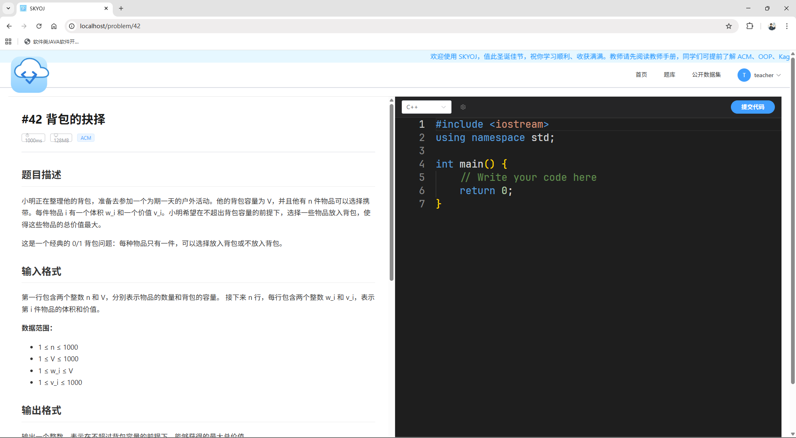
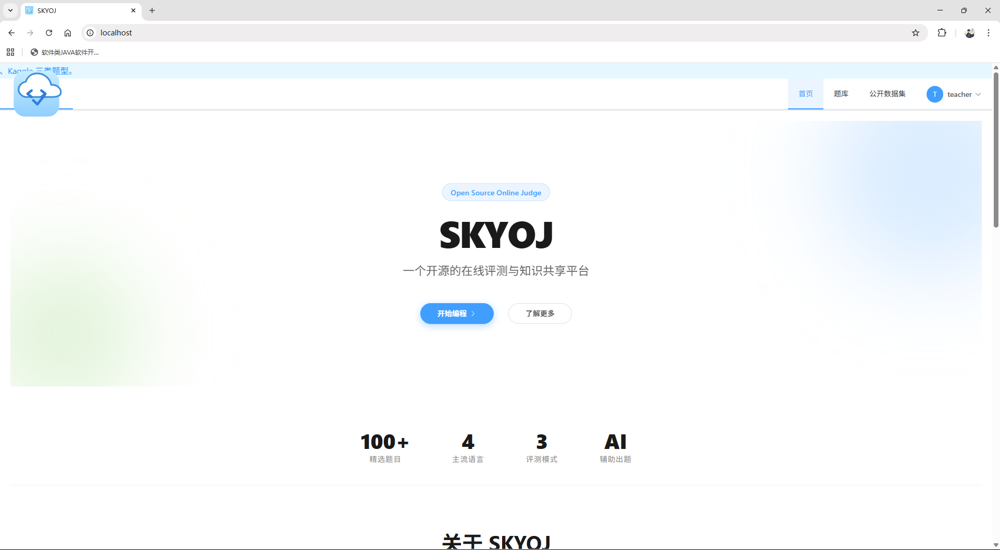
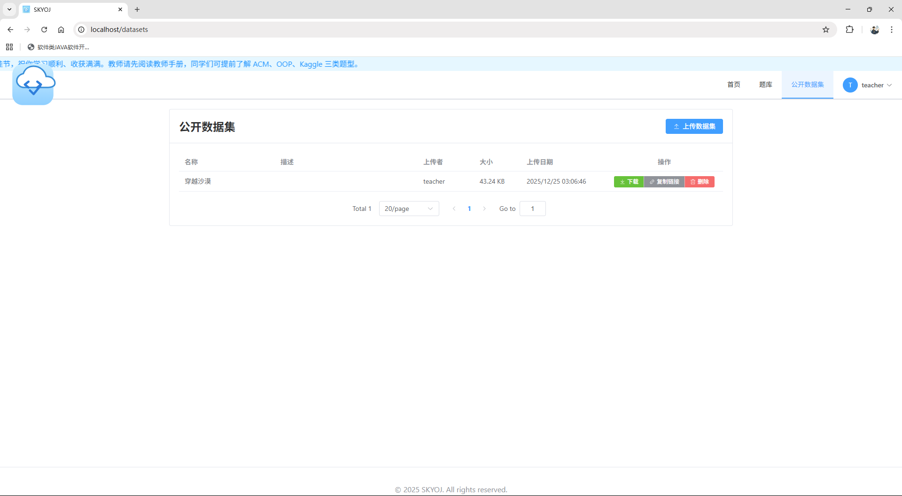
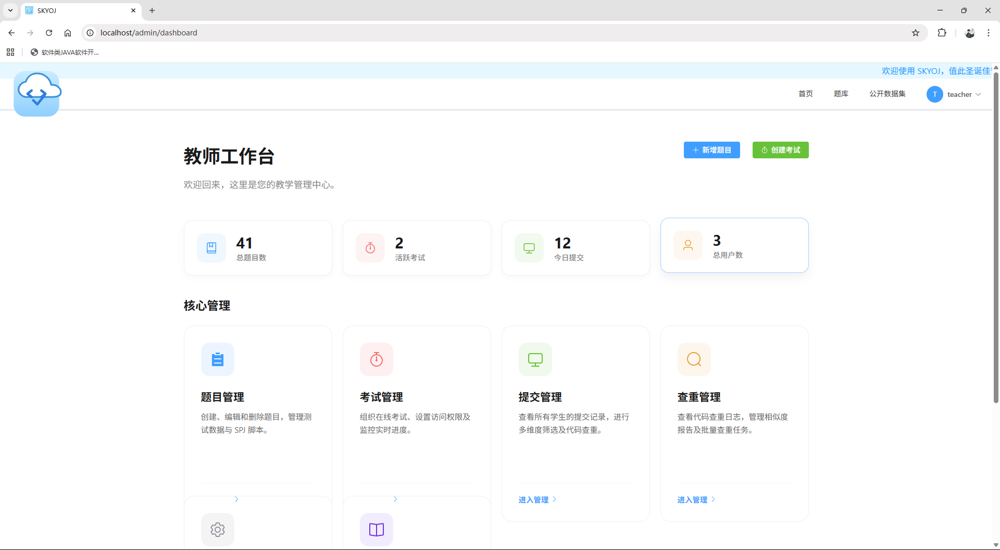
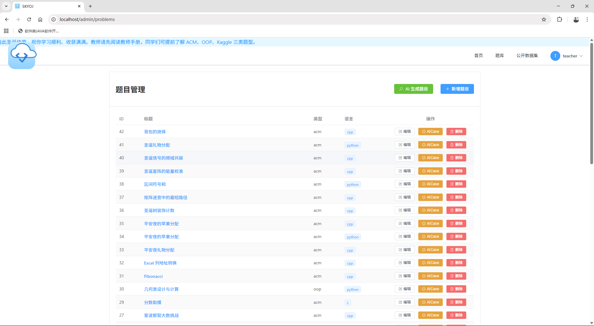

<h2 align="center">SKYOJ - 新一代 AI 驱动的在线评测系统</h2>

<p align="center">
  <a href="README.md">中文</a> |
  <a href="README_en.md">English</a>
</p>


<div align="center">
  
  
  
  
  
</div>

<br/>

**SKYOJ** 是一个专为高校计算机教学与数据科学竞赛设计的现代化在线判题系统（Online Judge）。

不同于传统仅支持 ACM 模式的 OJ，SKYOJ 采用 **Vue3 + Flask + Docker** 微服务架构，创新性地引入了 **OOP 单元测试**与 **Kaggle 数据科学**评测模式。系统深度集成了 **LLM（大语言模型）** 与 **深度学习向量模型**，实现了从“代码查重”到“智能助教”的全方位智能化辅助。

---

## 核心特性

### 1. 多模态评测体系 (Multi-Mode Judging)
打破传统算法题的局限，满足多元化教学需求：
- **ACM 经典模式**：基于标准输入输出（Std I/O）的比对，支持 C/C++、Java、Python 等主流语言。
- **OOP 面向对象模式**：支持上传 Test 脚本，对学生提交的类/方法进行黑盒测试，适合考察架构设计与封装能力。
- **Kaggle 数据科学模式**：支持大数据集处理与 CSV 结果比对，允许教师自定义评分脚本（如计算 RMSE, Accuracy），适用于机器学习课程。

### 2. AI 智能化增强 (AI-Powered)
- **AI 助教 (Smart Tutor)**：
  - 集成 **DeepSeek/OpenAI** 接口。
  - 采用 **CoT (思维链)** 与 **角色扮演** 提示词工程，引导学生分析逻辑漏洞，而非直接提供答案。
- **语义代码查重 (Semantic Plagiarism Detection)**：
  - 摒弃传统的文本编辑距离算法。
  - 内置微调过的 **Sentence-Transformers (UnixCoder)** 模型。
  - 将代码转换为高维语义向量，有效识别“变量重命名”、“语句乱序”等洗稿行为，相似度识别准确率 > 0.85。

### 3. 企业级系统架构
- **云原生架构**：基于 Docker Compose 编排，实现 Web 服务、数据库、评测沙箱的完全解耦。
- **异步评测调度**：采用非阻塞式任务分发机制，Web 主线程仅负责接收请求，由后台守护线程池处理耗时判题，确保高并发下的系统稳定性。
- **安全沙箱隔离**：
  - **网络熔断**：容器配置 `network_mode="none"`，阻断恶意联网。
  - **资源配额**：基于 Linux Cgroups 严格限制 CPU、内存及 PID 数，防止 Fork 炸弹与资源耗尽攻击。

---


## 技术栈

| 模块 | 技术选型 | 说明 |
| :--- | :--- | :--- |
| **前端** | Vue 3 + Vite | 配合 Monaco Editor 实现 IDE 级编码体验 |
| **后端** | Flask (Python) | 轻量级 RESTful API，SQLAlchemy ORM |
| **网关** | Nginx | 反向代理、负载均衡、静态资源加速 |
| **数据库** | MySQL 8.0 | 事务支持，存储用户数据与提交记录 |
| **容器化** | Docker & Compose | 全栈容器化部署，沙箱环境构建 |
| **AI 模型** | Sentence-Transformers | 语义向量计算，用于查重 |
| **LLM SDK** | OpenAI / DeepSeek | 智能助教推理服务 |

---

## 项目结构

```text
SKYOJ/
├── backend/                # Flask 后端业务逻辑
│   ├── app/                # API 接口与模型定义
│   └── sandbox/            # 评测沙箱配置
│       ├── runners/        # 判题镜像 (skyoj-runner) 构建文件
│       └── random_data/    # 数据生成镜像 (skyoj-generator) 构建文件
├── frontend/               # Vue3 前端源代码
├── docker/                 # 基础设施配置 (MySQL, Nginx)
├── generate/               # 题目自动化生成脚本
├── docker-compose.yml      # 容器编排配置
└── README.md               # 项目说明文档
```

---

## 快速开始 (Deployment)

本项目支持一键容器化部署。请确保本地已安装 **Git** 和 **Docker Desktop**。

### 第一步：获取代码

```bash
git clone https://github.com/TianyaSKY/SKYOJ.git
cd SKYOJ
```

### 第二步：构建沙箱镜像 (关键)

为了保证评测环境的安全性与独立性，需手动构建基础评测镜像：

```bash
# 1. 构建判题运行环境镜像 (包含 GCC, Python, Java 环境)
docker build -t skyoj-runner ./backend/sandbox/runners

# 2. 构建测试数据生成镜像
docker build -t skyoj-generator ./backend/sandbox/random_data
```

### 第三步：启动服务

使用 Docker Compose 拉起全栈服务：

```bash
# 后台启动所有服务
docker-compose up -d --build
```

### 第四步：访问系统

等待约 30 秒（数据库初始化）后访问：

* **前端页面**：http://localhost
* **后端 API**：http://localhost:5000/api
* **数据库管理**：(如配置了 phpMyAdmin) http://localhost:8080

---

## 系统截图










---

## 开发与贡献

**开发周期**: 2025.12.21 - 25

本项目是 **大连海洋大学信息工程学院** 本科生课程项目成果。欢迎提交 Issue 或 Pull Request 进行改进。

## 开源协议

本项目采用 [MIT License](https://opensource.org/licenses/MIT) 开源。
