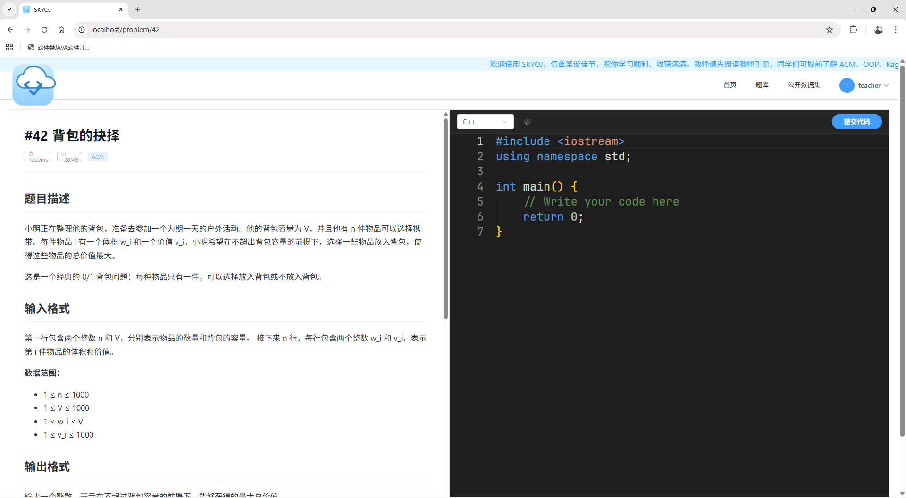
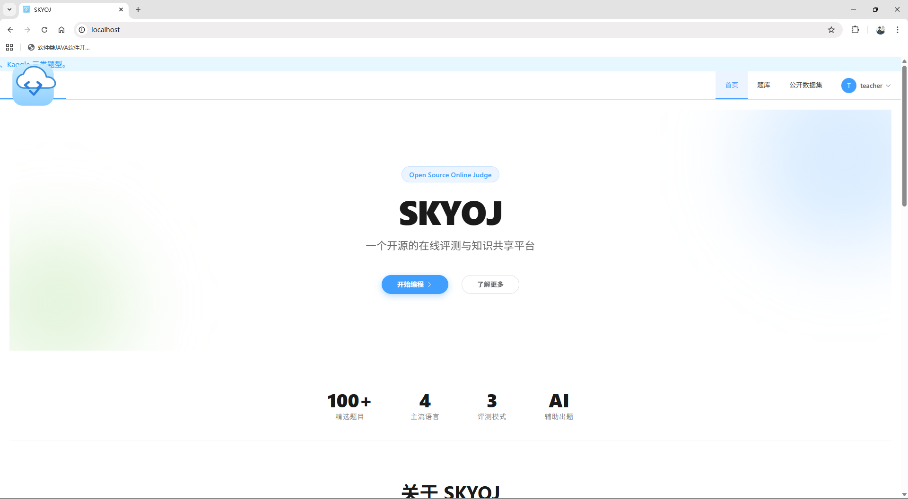
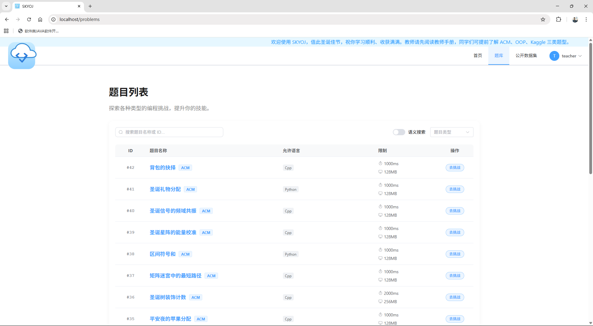
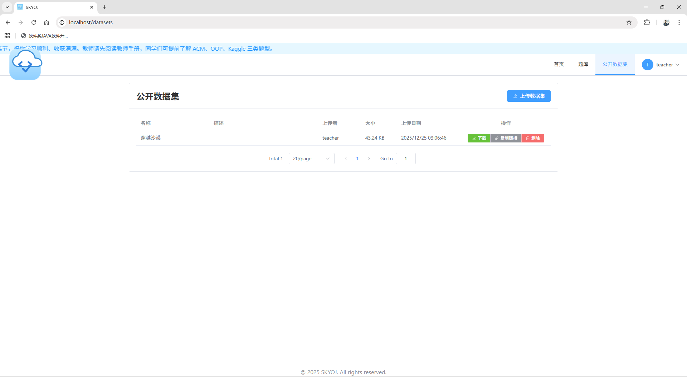
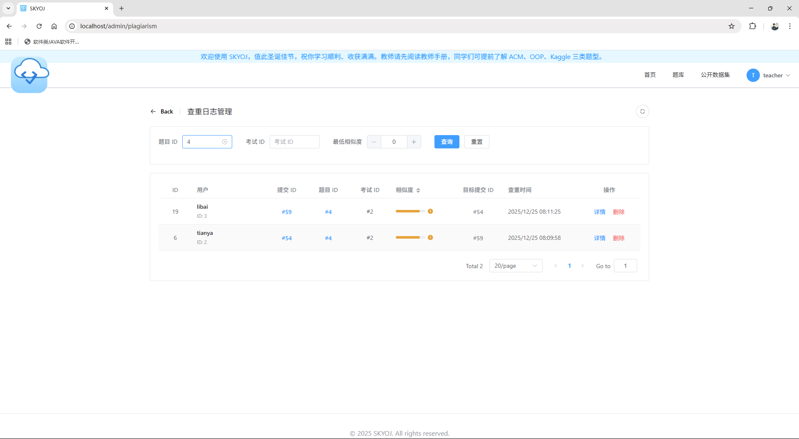
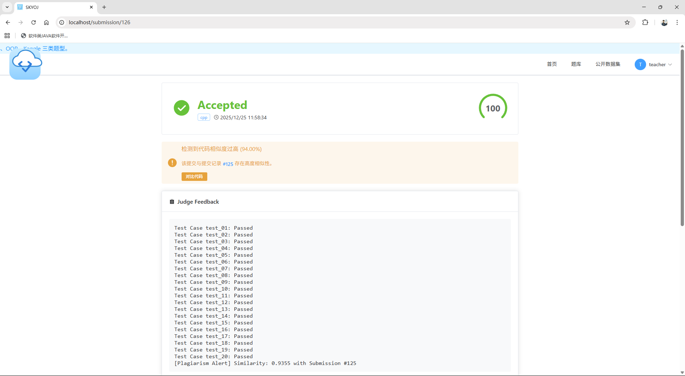
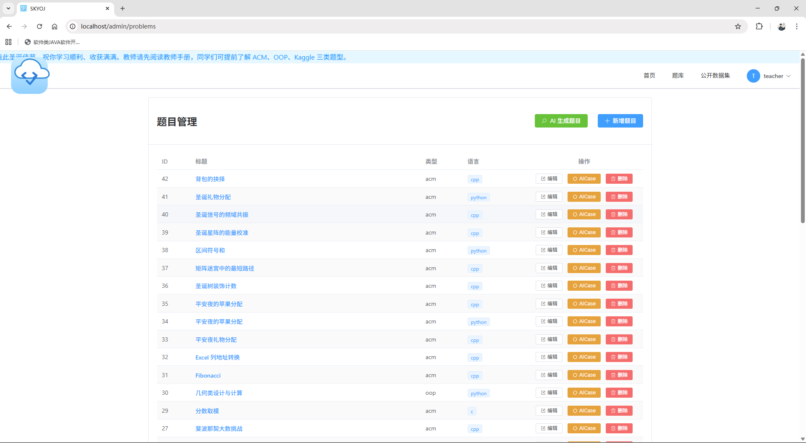


<h2 align="center">SKYOJ - Next-Generation AI-Powered Online Judge System</h2>

<p align="center">
  <a href="README.md">中文</a> |
  <a href="README_en.md">English</a>
</p>


<div align="center">
  
  
  
  
  
</div>

<br/>

**SKYOJ** is a modern Online Judge system designed for university computer science education and data science competitions.

Unlike traditional OJs that only support ACM mode, SKYOJ adopts a **Vue3 + FastAPI + Docker** microservice architecture and innovatively introduces **OOP Unit Testing** and **Kaggle Data Science** evaluation modes. The system deeply integrates **LLM (Large Language Models)** to provide smart tutoring capabilities.

---

## Core Features

### 1. Multi-Mode Judging
Breaks the limitations of traditional algorithm problems to meet diverse teaching needs:
- **ACM Classic Mode**: Comparison based on standard input/output (Std I/O), supporting mainstream languages like C/C++, Java, and Python.
- **OOP Object-Oriented Mode**: Supports uploading Test scripts for black-box testing of classes/methods submitted by students, suitable for assessing architectural design and encapsulation.
- **Kaggle Data Science Mode**: Supports large dataset processing and CSV result comparison, allowing teachers to customize scoring scripts (e.g., calculating RMSE, Accuracy), suitable for machine learning courses.

### 2. AI-Powered Enhancements
- **Smart Tutor**:
  - Integrated **DeepSeek/OpenAI** interfaces.
  - Employs **CoT (Chain of Thought)** and **Role-Playing** prompt engineering to guide students in analyzing logical flaws rather than providing direct answers.

### 3. Enterprise-Grade Architecture
- **Cloud-Native Architecture**: Orchestrated based on Docker Compose, achieving complete decoupling of Web services, databases, and evaluation sandboxes.
- **Asynchronous Evaluation Scheduling**: Uses RabbitMQ and Celery `solo` workers. The API persists jobs and Outbox records, while dedicated single-process workers serially handle judging, AI, and file tasks; scale out by adding worker containers.
- **Security Sandbox Isolation**:
  - **Network Circuit Breaking**: Containers are configured with `network_mode="none"` to block malicious networking.
  - **Resource Quotas**: Strictly limits CPU, memory, and PID counts based on Linux Cgroups to prevent Fork bombs and resource exhaustion attacks.

---


## Tech Stack

| Module | Technology Selection | Description |
| :--- | :--- | :--- |
| **Frontend** | Vue 3 + Vite | IDE-level coding experience with Monaco Editor |
| **Backend** | FastAPI (Python) | High-performance ASGI RESTful API, SQLAlchemy ORM |
| **Gateway** | Nginx | Reverse proxy, load balancing, static resource acceleration |
| **Database** | MySQL 8.0 | Transaction support, storing user data and submission records |
| **Messaging** | RabbitMQ + Celery | Reliable task delivery and serial workers |
| **Containerization** | Docker & Compose | Full-stack containerized deployment, sandbox environment construction |
| **LLM SDK** | OpenAI / DeepSeek | Smart tutor inference service |

---

## Project Structure

```text
SKYOJ/
├── backend/                # FastAPI backend business logic
│   └── app/                # API interfaces and model definitions
├── frontend/               # Vue3 frontend source code
├── docker/                 # All Docker configs (single directory)
│   ├── backend/            # Backend container Dockerfile
│   ├── frontend/           # Frontend container Dockerfile
│   ├── runner/             # Judge sandbox image (skyoj-runner)
│   ├── generator/          # Test-data generation image (skyoj-generator)
│   ├── mysql/              # MySQL init script
│   └── nginx/              # Nginx reverse proxy config
├── docker-compose.yml      # Container orchestration configuration
├── .env.example            # Environment variable template
└── README.md               # Project documentation
```

### Asynchronous task processes

The system keeps only the `judge`, `ai`, and `file` queues. The API stores task parameters in MySQL, and an Outbox Dispatcher publishes task IDs to RabbitMQ. Workers run with `--pool=solo --concurrency=1`; no in-process thread pool is used. The Judge Worker is the only service that mounts the Docker Socket.

---

## Quick Start (Deployment)

This project supports one-click containerized deployment. Please ensure **Git** and **Docker Desktop** are installed locally.

### Step 1: Get the Code

```bash
git clone https://github.com/TianyaSKY/SKYOJ.git
cd SKYOJ
```

### Step 2: Configure Environment Variables

```bash
cp .env.example .env
```

Please configure at least these LLM variables (for AI tutor and test-data generation):

- `LLM_API_URL`
- `LLM_MODEL_NAME`
- `LLM_API_KEY`

You must also replace `MYSQL_ROOT_PASSWORD`, `MYSQL_PASSWORD`, and `SECRET_KEY` with strong locally generated values, and keep `DATABASE_URL` pointed at the non-root `MYSQL_USER` account. The repository does not provide usable defaults for these values.

Public registration creates student accounts only. Create a teacher account interactively inside the backend container:

```bash
docker compose exec backend python scripts/create_teacher.py
```

### Step 3: Build Sandbox Images (Critical)

To ensure the security and independence of the evaluation environment, build the judging and test-data generation sandbox images first.

**Recommended: one-click scripts**

```bash
# Linux / macOS
chmod +x scripts/build-sandbox.sh
./scripts/build-sandbox.sh

# Windows (cmd / PowerShell)
scripts\build-sandbox.bat
```

Optional flags:

```bash
./scripts/build-sandbox.sh runner          # only skyoj-runner
./scripts/build-sandbox.sh generator       # only skyoj-generator
./scripts/build-sandbox.sh --no-cache      # force rebuild without cache
```

**Or build manually:**

```bash
# 1. Build the judging runtime environment image (includes GCC, Python, Java)
docker build -t skyoj-runner ./docker/runner

# 2. Build the test data generation image
docker build -t skyoj-generator ./docker/generator
```
### Step 4: Start Services

Use Docker Compose to pull up the full-stack services:

```bash
# Start all services in the background
docker-compose up -d --build
```

### Step 5: Access the System

Wait about 30 seconds (database initialization) and then access:

* **Frontend Page**: http://localhost
* **Backend API**: http://localhost/api
* **Database Management**: (if phpMyAdmin is configured) http://localhost:8080

---

## System Screenshots









---

## Development and Contribution

**Development Period**: 2025.12.21 - 25

This project is a result of an undergraduate course project at the **School of Information Engineering, Dalian Ocean University**. Issues or Pull Requests for improvements are welcome.

## License

This project is open-sourced under the [MIT License](https://opensource.org/licenses/MIT).
